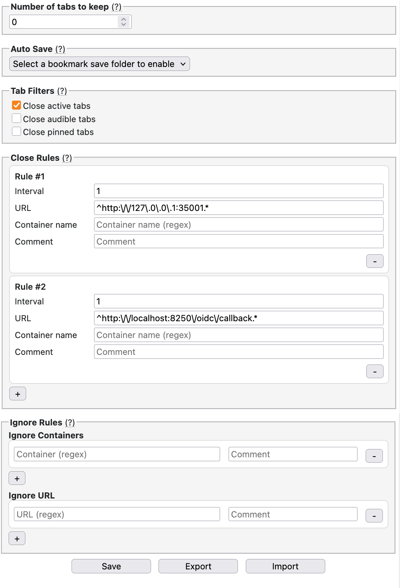

# Tab AutoClose

Tab AutoClose is a browser extension for keeping tab counts under control with a
global tab limit, regex-based close rules, regex-based ignore rules, and
optional bookmark saving for tabs that get closed automatically.

The options UI is designed to make those rules editable without manually
touching stored preference strings. You can set how many matching tabs should
remain open, decide whether auto-closed tabs should first be saved as bookmarks
in a selected folder, and control whether active, audible, or pinned tabs are
eligible for automatic closing at all.

Close Rules use regular expressions to decide which tabs are candidates for
cleanup. Each rule combines:

- an idle interval in seconds
- a container-name regular expression
- a URL regular expression
- an optional comment

When a tab matches the container and URL patterns and has been inactive for at
least the configured interval, it can be considered for closing. Tabs are then
closed from oldest to newest activity until the remaining number of eligible
tabs is down to the configured threshold.

Ignore Rules also use regular expressions, but they work as exclusions. You can
define container-based ignores and URL-based ignores so specific tab types are
never auto-closed even if they would otherwise match a close rule.

The bookmark-saving option stores a bookmark for each tab immediately before it
is closed. If no bookmark folder is selected, tabs are simply closed without
being saved. The tab filter toggles let you include or exclude active tabs,
audible tabs, and pinned tabs from cleanup, which is useful if you want
aggressive cleanup for background tabs while leaving currently used or
intentionally pinned tabs alone.

## History

This extension is based on auto-close-tabs, which is part of the following
project: https://github.com/igorlogius/webextensions/. The original extension is
public domain, but with different goals from this extension, so this is
essentially a fork of that extension developed under my own command.
